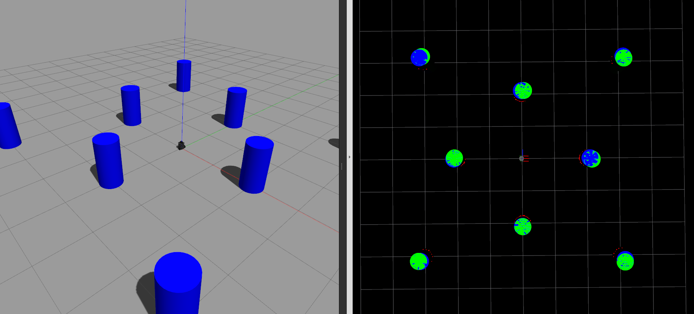

# Awesome SLAM


## Overview

EKF-SLAM and UKF-SLAM on Turtlebot3



## Install

```
cd $HOME && git clone --recursive https://github.com/iamarkaj/AwesomeSLAM.git
cd AwesomeSLAM && chmod 755 install.sh
./install.sh
```

## Usage

#### Edit landmark positions at
```
awesome_slam/config/landmarks.yaml
```

#### Open Gazebo and Rviz
```
roslaunch awesome_slam awesome_slam.launch
```

#### Run EKF/UKF 
```
rosrun awesome_slam ekf
```
```
rosrun awesome_slam ukf
```

#### Launch turtlebot3_teleop
```
roslaunch turtlebot3_teleop turtlebot3_teleop_key.launch
```

## awesome_slam (directory structure)

```
├── CMakeLists.txt
├── config
│   ├── display.rviz
│   └── landmarks.yaml
├── include
│   └── awesome_slam
│       ├── common.h
│       ├── config.h
│       ├── structures.h
│       └── tools.h
├── launch
│   └── awesome_slam.launch
├── models
│   ├── awesome_boundary
│   │   ├── model.config
│   │   └── model.sdf
│   └── awesome_cylinder
│       ├── model.config
│       └── model.sdf
├── package.xml
├── src
│   ├── ekf
│   │   ├── ekf.cpp
│   │   └── ekf.h
│   ├── gazebo_spawn
│   │   ├── gazebo_spawn.cpp
│   │   └── gazebo_spawn.h
│   ├── sensor_landmark
│   │   ├── sensor_landmark.cpp
│   │   └── sensor_landmark.h
│   ├── ukf
│   │   ├── ukf.cpp
│   │   └── ukf.h
│   └── visualize_landmark
│       ├── visualize_landmark.cpp
│       └── visualize_landmark.h
└── worlds
    └── awesome_slam.world
```
